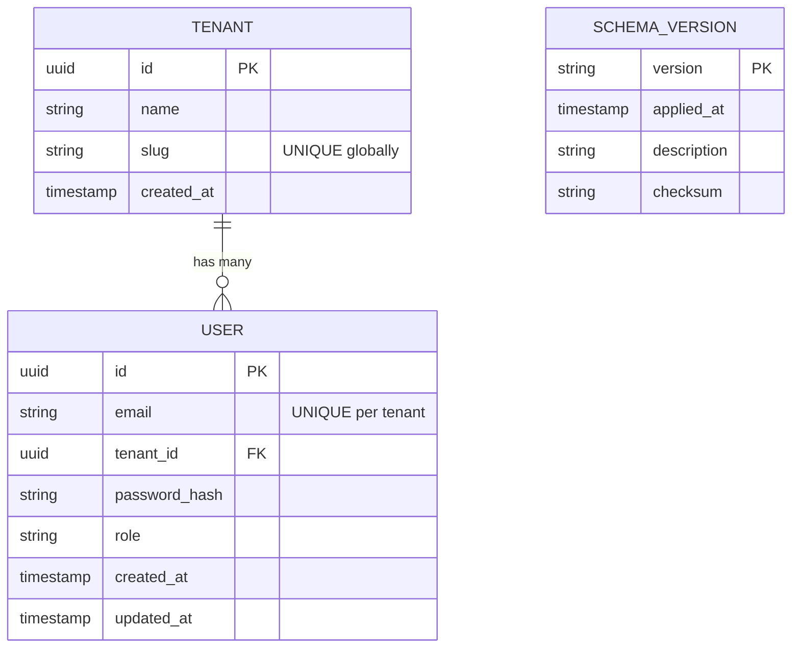

# Data Model: V1.0 Release - Legacy Code Removal & Cleanup

**Feature**: 012-v1-cleanup-legacy-removal  
**Date**: 2025-10-20

---

## Overview

This feature modifies existing data model constraints rather than adding new entities. Primary change is email uniqueness enforcement shifting from global scope to per-tenant scope.

---

## Modified Entities

### User Entity

**Table**: `users`

**Schema Change**: Email Uniqueness Constraint

**Before (Pre-V1.0)**:
```sql
CREATE TABLE users (
    id UUID PRIMARY KEY DEFAULT uuid_generate_v4(),
    email VARCHAR(255) NOT NULL,
    tenant_id UUID NOT NULL REFERENCES tenants(id),
    password_hash VARCHAR(255) NOT NULL,
    role VARCHAR(50) NOT NULL,
    created_at TIMESTAMP WITH TIME ZONE NOT NULL DEFAULT NOW(),
    updated_at TIMESTAMP WITH TIME ZONE NOT NULL DEFAULT NOW(),
    CONSTRAINT users_email_key UNIQUE (email)  -- GLOBAL uniqueness
);
```

**After (V1.0)**:
```sql
CREATE TABLE users (
    id UUID PRIMARY KEY DEFAULT uuid_generate_v4(),
    email VARCHAR(255) NOT NULL,
    tenant_id UUID NOT NULL REFERENCES tenants(id),
    password_hash VARCHAR(255) NOT NULL,
    role VARCHAR(50) NOT NULL,
    created_at TIMESTAMP WITH TIME ZONE NOT NULL DEFAULT NOW(),
    updated_at TIMESTAMP WITH TIME ZONE NOT NULL DEFAULT NOW()
    -- REMOVED: CONSTRAINT users_email_key UNIQUE (email)
);

-- NEW: Per-tenant email uniqueness
CREATE UNIQUE INDEX idx_users_email_tenant ON users (email, tenant_id);
```

**Validation Rules**:

| Rule | Implementation | Enforcement Layer |
|------|----------------|-------------------|
| Email Format | RFC 5322 compliant regex | Application (Pydantic) |
| Email Normalization | Lowercase before storage | Application (service layer) |
| Email Uniqueness | Composite index `(email, tenant_id)` | Database + Application |
| Tenant Association | Foreign key `tenant_id -> tenants(id)` | Database |

**Application Layer Validation**:
```python
# src/domain/users/entities.py (domain model - no change)
@dataclass
class User:
    id: UUID
    email: str  # Normalized (lowercase)
    tenant_id: UUID
    password_hash: str
    role: str
    created_at: datetime
    updated_at: datetime

# src/adapters/persistence/user_repository.py (NEW METHOD)
class UserRepository:
    async def get_by_email_and_tenant(
        self, email: str, tenant_id: UUID
    ) -> Optional[User]:
        """Fetch user by email within tenant scope"""
        normalized_email = email.lower()
        query = select(UserModel).where(
            func.lower(UserModel.email) == normalized_email,
            UserModel.tenant_id == tenant_id
        )
        result = await self.session.execute(query)
        return result.scalar_one_or_none()

# src/services/user_service.py (UPDATED VALIDATION)
class UserService:
    async def create_user(self, email: str, tenant_id: UUID, ...) -> User:
        # Check uniqueness within tenant
        existing = await self.repository.get_by_email_and_tenant(
            email, tenant_id
        )
        if existing:
            raise DomainError(
                code="EMAIL_ALREADY_EXISTS",
                message=f"Email '{email}' is already registered in this tenant"
            )
        # ... proceed with creation
```

**Error Messages**:

| Scenario | HTTP Status | Error Code | Message |
|----------|-------------|------------|---------|
| Duplicate email in same tenant | 409 Conflict | `EMAIL_ALREADY_EXISTS` | "Email '{email}' is already registered in this tenant" |
| Duplicate email in different tenant | 201 Created | N/A | Success (allowed) |
| Invalid email format | 422 Unprocessable Entity | `INVALID_EMAIL_FORMAT` | "Email must be a valid RFC 5322 address" |

**Migration Impact**:

- **No Data Loss**: Existing users unaffected (email + tenant_id combinations are already unique in practice)
- **No Conflicts**: Pre-migration validation script checks for duplicate (email, tenant_id) pairs
- **Rollback Risk**: Downgrade migration restores global uniqueness but may fail if post-upgrade data introduced duplicate emails across tenants

---

## New Entities

### SchemaVersion Metadata Table

**Table**: `schema_version`

**Purpose**: Track database schema version for V1.0 release and future upgrades.

**Schema**:
```sql
CREATE TABLE schema_version (
    version VARCHAR(20) PRIMARY KEY,
    applied_at TIMESTAMP WITH TIME ZONE NOT NULL DEFAULT NOW(),
    description TEXT,
    checksum VARCHAR(64)  -- SHA256 of schema DDL
);

-- Insert V1.0 marker
INSERT INTO schema_version (version, description)
VALUES ('1.0.0', 'Initial V1.0 release schema');
```

**Fields**:

| Field | Type | Constraints | Description |
|-------|------|-------------|-------------|
| `version` | VARCHAR(20) | PRIMARY KEY | Semantic version (e.g., "1.0.0") |
| `applied_at` | TIMESTAMP WITH TIME ZONE | NOT NULL, DEFAULT NOW() | When schema version was applied |
| `description` | TEXT | NULL | Human-readable description |
| `checksum` | VARCHAR(64) | NULL | SHA256 hash of full schema DDL for integrity verification |

**Usage**:
- Query current schema version: `SELECT version FROM schema_version ORDER BY applied_at DESC LIMIT 1`
- Verify schema integrity: Compare computed checksum with stored value

**Rationale**:
- Independent of Alembic `alembic_version` table (which tracks migration IDs, not semantic versions)
- Supports external tooling (monitoring, deployment scripts) querying schema version
- Checksum enables detection of out-of-band schema modifications

---

## Unchanged Entities

The following entities remain unchanged by this feature:

- **Tenant**: No schema changes
- **Role**: No schema changes
- **Policy**: No schema changes
- **AuditEvent**: Schema unchanged (metadata field `version` added at application layer, not DB schema)
- **FeatureFlag**: No schema changes

---

## Entity Relationships



**Key Relationships**:
- User → Tenant: Many-to-One (via `users.tenant_id → tenants.id`)
- Email uniqueness constraint: Composite across `(email, tenant_id)` ensures per-tenant namespaces

---

## State Transitions

No state machine changes introduced by this feature. User lifecycle (active → disabled → deleted) remains unchanged.

---

## Indexes

### Modified Indexes

**Removed**:
```sql
DROP CONSTRAINT users_email_key;  -- Global unique constraint
```

**Added**:
```sql
CREATE UNIQUE INDEX idx_users_email_tenant ON users (email, tenant_id);
```

**Rationale**: Composite unique index serves dual purpose:
1. Enforces per-tenant email uniqueness
2. Optimizes queries: `WHERE email = ? AND tenant_id = ?` (common pattern for login)

### Existing Indexes (Unchanged)

- `users_tenant_id_idx`: For tenant-scoped queries (`WHERE tenant_id = ?`)
- `tenants_slug_idx`: For tenant resolution by slug
- (Other indexes in tenants, policies, audit_events tables remain unchanged)

---

## Data Volume & Scale

**Expected Impact**:
- **User Table Size**: No change (same row count, same column count)
- **Index Size**: Composite index `idx_users_email_tenant` size ~= previous `users_email_key` index (both index email column + additional tenant_id column ~16 bytes per row)
- **Query Performance**: Marginal improvement for email lookups (composite index includes tenant_id filter directly)

**Performance Benchmarks** (to be validated in Phase 5):
- Email lookup by tenant: <50ms p95 (target: <30ms actual)
- User creation with uniqueness check: <100ms p95 (target: <70ms actual)

---

## Migration Strategy

### Pre-Migration Validation

```python
# scripts/validate_email_migration.py
async def validate_no_email_conflicts():
    """
    Check for duplicate (email, tenant_id) combinations
    before applying composite unique index.
    """
    conflicts_query = """
        SELECT tenant_id, email, COUNT(*) as cnt
        FROM users
        GROUP BY tenant_id, email
        HAVING COUNT(*) > 1
    """
    # Expected result: 0 rows (no conflicts in well-behaved system)
    # If conflicts found: Manual data cleanup required before migration
```

### Migration SQL

**Upgrade**:
```sql
BEGIN;

-- Drop global unique constraint (may not exist if already removed)
ALTER TABLE users DROP CONSTRAINT IF EXISTS users_email_key;

-- Add composite unique index
CREATE UNIQUE INDEX IF NOT EXISTS idx_users_email_tenant 
ON users (email, tenant_id);

-- Insert schema version marker
INSERT INTO schema_version (version, description)
VALUES ('1.0.0', 'V1.0 release: Per-tenant email uniqueness')
ON CONFLICT (version) DO NOTHING;

COMMIT;
```

**Downgrade** (Risky - may fail):
```sql
BEGIN;

-- Remove composite index
DROP INDEX IF EXISTS idx_users_email_tenant;

-- Attempt to restore global unique constraint
-- WARNING: Will fail if duplicate emails exist across tenants
ALTER TABLE users ADD CONSTRAINT users_email_key UNIQUE (email);

-- Remove V1.0 schema version marker
DELETE FROM schema_version WHERE version = '1.0.0';

COMMIT;
```

### Rollback Considerations

- **Forward Migration**: Safe (composite index is more permissive than global unique)
- **Backward Migration**: **UNSAFE** if post-upgrade data introduced same email in different tenants
- **Recommendation**: Test downgrade in staging; document as breaking change

---

## Testing Strategy

### Unit Tests (Domain Layer)

```python
# tests/unit/test_user_entity.py
def test_user_email_normalized_on_creation():
    """Email stored in lowercase"""
    user = User(email="Test@EXAMPLE.com", ...)
    assert user.email == "test@example.com"
```

### Integration Tests (Repository Layer)

```python
# tests/integration/test_user_repository.py
@pytest.mark.asyncio
async def test_get_by_email_and_tenant_case_insensitive(repository):
    """Email lookup is case-insensitive within tenant"""
    await repository.create(User(email="test@example.com", tenant_id=tenant_a, ...))
    
    found = await repository.get_by_email_and_tenant("TEST@Example.com", tenant_a)
    assert found is not None
    assert found.email == "test@example.com"
```

### Contract Tests (API Layer)

```python
# tests/contract/test_email_uniqueness.py
@pytest.mark.asyncio
async def test_duplicate_email_same_tenant_rejected(client, auth_headers):
    """POST /api/v1/admin/users rejects duplicate email in same tenant"""
    payload = {"email": "test@example.com", "tenant_id": str(tenant_a), ...}
    
    # First creation: success
    response1 = await client.post("/api/v1/admin/users", json=payload, headers=auth_headers)
    assert response1.status_code == 201
    
    # Duplicate in same tenant: conflict
    response2 = await client.post("/api/v1/admin/users", json=payload, headers=auth_headers)
    assert response2.status_code == 409
    assert response2.json()["error"]["code"] == "EMAIL_ALREADY_EXISTS"

@pytest.mark.asyncio
async def test_duplicate_email_different_tenant_allowed(client, auth_headers):
    """POST /api/v1/admin/users allows same email in different tenants"""
    payload_a = {"email": "test@example.com", "tenant_id": str(tenant_a), ...}
    payload_b = {"email": "test@example.com", "tenant_id": str(tenant_b), ...}
    
    response1 = await client.post("/api/v1/admin/users", json=payload_a, headers=auth_headers)
    assert response1.status_code == 201
    
    response2 = await client.post("/api/v1/admin/users", json=payload_b, headers=auth_headers)
    assert response2.status_code == 201  # Success: different tenant
```

---

## Summary

- **Primary Change**: Email uniqueness enforcement from global → per-tenant scope
- **New Entity**: `schema_version` metadata table for version tracking
- **No New Domain Entities**: This is a cleanup/constraint modification feature
- **Migration**: Transaction-safe Alembic migration with pre-validation
- **Risk**: Low (constraint relaxation, not tightening; no data loss expected)

---

**Version**: 1.0  
**Status**: Complete  
**Next Phase**: Phase 1 - Contracts (OpenAPI spec + failing tests)
